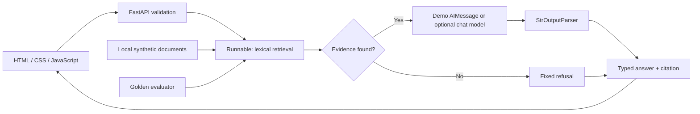

# QA Knowledge Lab
### Answers with evidence. Quality by design.

A portfolio project for **Yasser — QA Automation + AI Engineer**. Ask questions about a fictional engineering team's QA playbook, inspect cited evidence, and run a repeatable quality gate.

**Default: no API key, no paid service, no model download.** Dependency and Chromium installation require internet once. Runtime demo answers come from six local synthetic documents, not an LLM. The optional model adapter is separate.

## Run locally

Use Python **3.11 or 3.12** (verified on 3.12). From this repository's root:

```bash
python3 -m venv .venv
source .venv/bin/activate
python -m pip install -r requirements-lock.txt
python -m pip install --no-deps -e .
uvicorn app.main:app --reload --host 127.0.0.1 --port 8000
```

On Windows, activate with `.venv\Scripts\Activate.ps1` in PowerShell. Open [the app](http://127.0.0.1:8000) and [interactive API docs](http://127.0.0.1:8000/docs). Keep the repository checkout: installation is editable and the app reads `data/` from the checkout. This project is not packaged as a standalone distribution wheel.

Try **What are the release gates?**, **How do payment API retries work?**, and **What is the CEO salary?** The last should refuse because no document supports it.

```bash
curl -X POST http://127.0.0.1:8000/api/ask \
  -H 'Content-Type: application/json' \
  -d '{"question":"What are the release gates?"}'
```

## Verify

In another activated terminal at the repository root:

```bash
pytest -m "not e2e"
python -m app.evaluate
python -m playwright install chromium
# Keep the demo server running on port 8000 for browser tests:
pytest -m e2e --browser chromium --tracing retain-on-failure
```

For Linux browser dependencies use `python -m playwright install --with-deps chromium`. Set `BASE_URL` if using a different port. `pytest` without a marker runs everything and therefore also needs the running server. Browser tests expect `QA_MODE=demo`.

The evaluator writes `reports/latest.json` and returns exit code 1 on any failed case or an empty dataset. Every one of the 12 cases must pass. This is an intentionally strict **demo regression gate**, not a universal AI quality benchmark. The committed [sample report](reports/sample-demo.json) records one actual verified run; [verification notes](docs/VERIFICATION.md) state what was and was not tested.

## What this demonstrates

| Existing QA skill | AI-oriented extension |
|---|---|
| API automation | HTTP validation, error handling, pinned response contract |
| Fixtures and synthetic data | Injected document corpora and a versioned golden dataset |
| Playwright | Evidence display, refusal UX, failure recovery, mobile layout and text rendering |
| CI/CD | Automated test and evaluation gates with downloadable evidence |
| QA leadership | Explicit scope, test strategy, defect detection, honest release criteria |
| Python / LangChain | Runnable composition, invocation, prompt construction, output parsing |

This project deliberately uses Python Playwright to keep one test language while building on Yasser's existing Playwright and Selenium/Java experience. It does not include Selenium or Java implementations.

## Architecture



Retrieval chooses one document using keyword coverage and a 0.6 threshold. Demo generation returns its exact text. The UI displays sources supplied by the server. The parser converts message content to a string; it does **not** establish truth. Pydantic validates shape, not factual correctness. Retrieval score is lexical coverage, not a calibrated probability or confidence measure.

See the [learner guide](docs/LEARNER_GUIDE.md) for every source file and the [test strategy](docs/TEST_STRATEGY.md) for risks and coverage.

## Optional real model

The default never needs credentials. To deliberately enable a remote model:

```bash
python -m pip install -e ".[openai]"
export QA_MODE=openai
export QA_MODEL=gpt-4.1-mini
# Set OPENAI_API_KEY securely in your own shell; never commit it.
uvicorn app.main:app --host 127.0.0.1 --port 8000
```

`.env.example` documents configuration; `.env` is **not loaded automatically**. Export variables yourself. In PowerShell use `$env:QA_MODE="openai"` and equivalent assignments. Restart the server when changing modes. Unsupported mode names fail at startup; missing credentials fail early. With a real model, supported questions and retrieved synthetic evidence are sent to the provider and usage may incur charges. Model availability is account-dependent; `QA_MODEL` is configurable.

```bash
python -m app.evaluate --mode openai --output reports/openai.json
```

The real model adapter has prompt/parsing/refusal tests using a fake model, but no paid live-model calls were made. The extractive grounding check intentionally remains strict: paraphrases can fail it. A source attached to a real model answer does not prove the answer follows that source. Review live outputs manually before drawing conclusions. Never use the default demo pass rate as evidence of real-model quality.

## Limitations and next experiments

- Six synthetic documents and twelve hand-authored cases are a small learning set. The dataset and keyword lists were designed together, so this is not a held-out accuracy estimate.
- Lexical retrieval misses paraphrases and can select irrelevant evidence when words overlap. The refusal examples are regression cases, not proof of injection resistance.
- No uploads, vector database, agents, conversation memory, authentication, persistence, rate limiting, or production deployment. Bind locally; public deployment needs additional engineering.
- Demo answers are deterministic excerpts; no learned generation runs in demo mode. Real generation can hallucinate even with a valid citation.
- The optional provider package is resolved separately, outside the demo lock. The demo dependency lock pins exact versions but does not include package hashes.
- GitHub Actions is prepared, not remotely executed. No repository was published.

Good next experiments: add independently written paraphrase cases; compare retrieval approaches on a held-out split; define factual claim checks for real outputs; run repeated live evaluations with cost/latency reporting. Change one thing at a time and preserve failing examples.

## Start learning — one step only

```bash
python examples/01_runnables.py
```

First predict the output. A **runnable** is a component with a standard execution interface. `.invoke(input)` runs it once. The `|` operator passes the previous output to the next runnable. `StrOutputParser()` turns `AIMessage` into text. Open [Step 1](docs/LEARNER_GUIDE.md#step-1--runnables-invoke-and-output-parsing), do the small exercise, then stop before moving on.

## Truthful resume wording

“Built a Python/FastAPI QA knowledge assistant using LangChain runnables, with deterministic offline execution, API contract tests, Playwright workflows, and a synthetic golden-dataset regression gate integrated into GitHub Actions.”

Only add measured counts after running the suite yourself. Do not claim production deployment, general LLM safety, or proven live-model accuracy. Be ready to explain and modify each component.

## GitHub preparation

Upload this folder's contents as your repository root. `.gitignore` excludes local environments, credentials, caches, and generated reports. Review the files and choose a license before public sharing; no license is assumed here. CI runs on push and pull request without secrets. No external account or repository has been created.

## References

- [LangChain Runnable reference](https://reference.langchain.com/python/langchain-core/runnables/base)
- [LangChain string output parser](https://reference.langchain.com/python/langchain-core/output_parsers/string)
